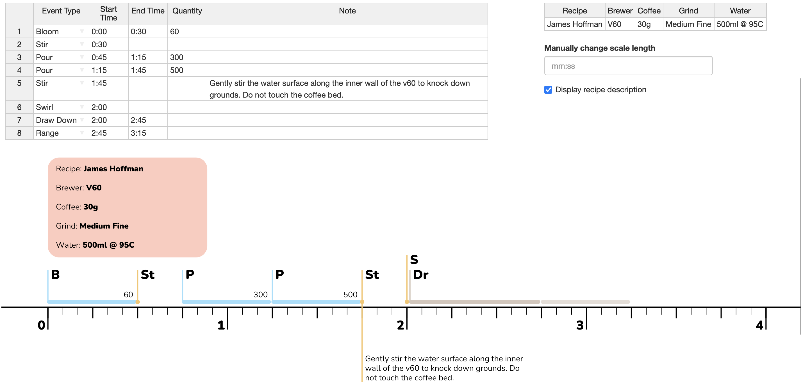
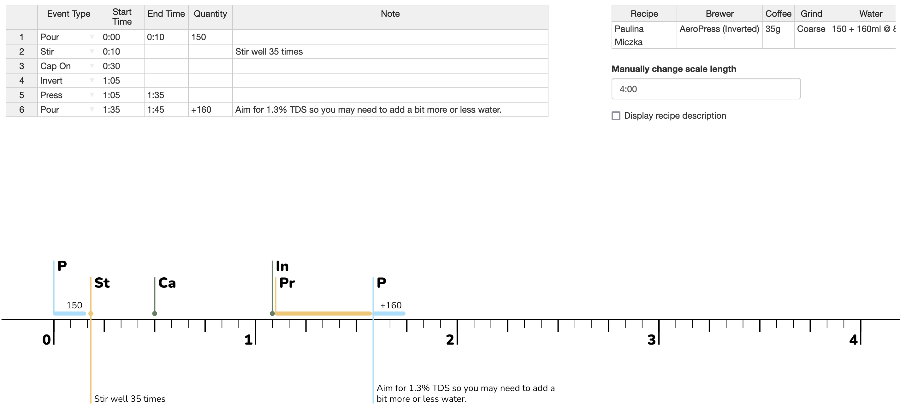
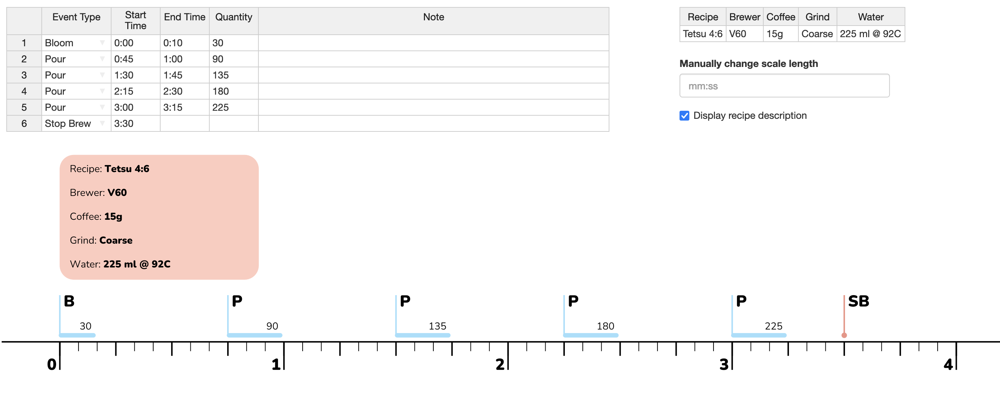

# Ārāmse receipe builder 

A web app implementation of Ārāmse's system for writing down coffee brewing recipes. 

There's a youtube video [here](https://www.youtube.com/watch?v=FbJ7KlW24kU) and a description [here](https://aramse.coffee/recipe/).

The app can be downloaded and run locally (you will need to install [R](https://cran.r-project.org/) and [RStudio](https://www.rstudio.com/products/rstudio/download/#download)), or in the web browser via [this R Shiny app](http://aramse.krukar.eu/).

Thanks to [Ārāmse](https://aramse.coffee/) for a great idea and beautiful design.

